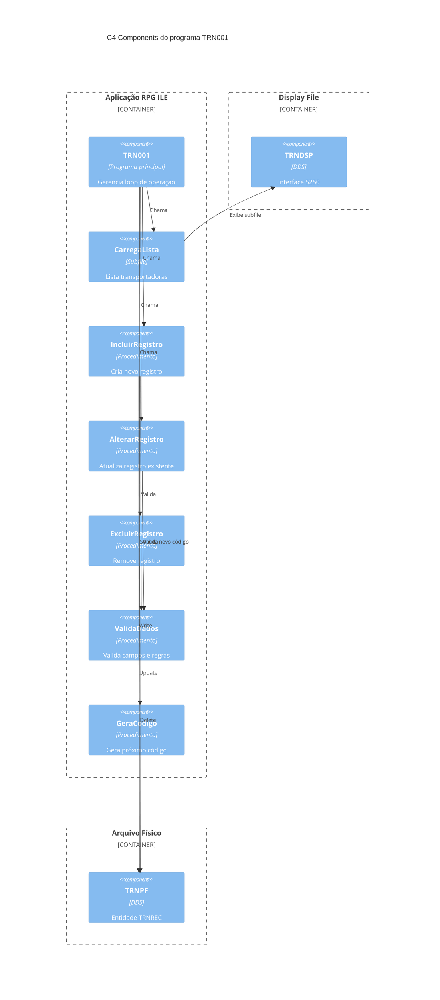

# C4 Components — `transportadora`

```mermaid
C4Component
    title C4 Components do programa TRN001

    Container_Boundary(appB, "Aplicação RPG ILE") {
        Component(main, "TRN001", "Programa principal", "Gerencia loop de operação")
        Component(list, "CarregaLista", "Subfile", "Lista transportadoras")
        Component(insert, "IncluirRegistro", "Procedimento", "Cria novo registro")
        Component(update, "AlterarRegistro", "Procedimento", "Atualiza registro existente")
        Component(delete, "ExcluirRegistro", "Procedimento", "Remove registro")
        Component(validate, "ValidaDados", "Procedimento", "Valida campos e regras")
        Component(seq, "GeraCodigo", "Procedimento", "Gera próximo código")
    }

    Container_Boundary(screenB, "Display File") {
        Component(screenUi, "TRNDSP", "DDS", "Interface 5250")
    }

    Container_Boundary(dataB, "Arquivo Físico") {
        Component(file, "TRNPF", "DDS", "Entidade TRNREC")
    }

    Rel(main, list, "Chama")
    Rel(main, insert, "Chama")
    Rel(main, update, "Chama")
    Rel(main, delete, "Chama")
    Rel(insert, validate, "Valida")
    Rel(update, validate, "Valida")
    Rel(insert, seq, "Solicita novo código")
    Rel(list, screenUi, "Exibe subfile")
    Rel(insert, file, "Write")
    Rel(update, file, "Update")
    Rel(delete, file, "Delete")
```
