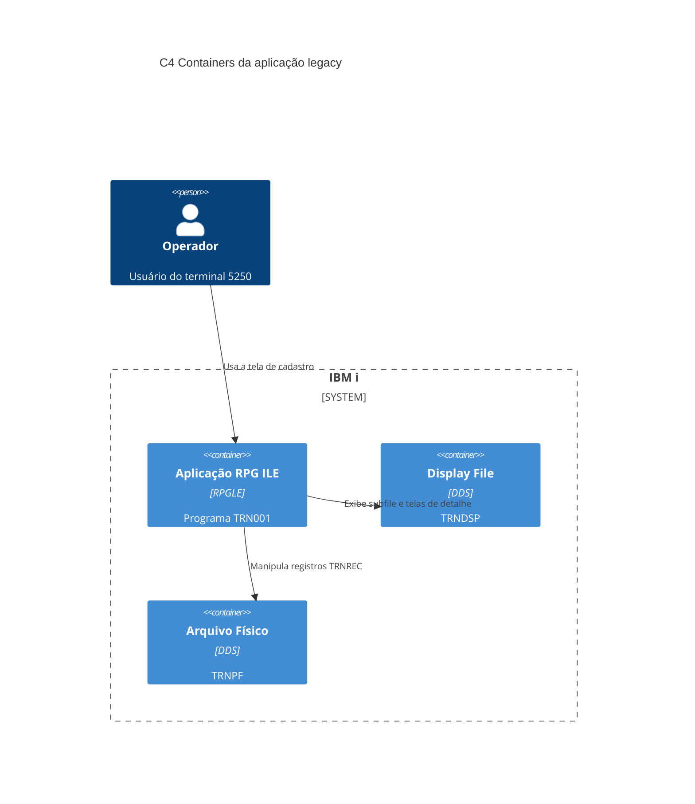

# C4 Containers — `transportadora`

```mermaid
C4Container
    title C4 Containers da aplicação legacy

    Person(usuario, "Operador", "Usuário do terminal 5250")

    System_Boundary(legacy, "IBM i") {
        Container(app, "Aplicação RPG ILE", "RPGLE", "Programa TRN001")
        Container(screen, "Display File", "DDS", "TRNDSP")
        Container(db, "Arquivo Físico", "DDS", "TRNPF")
    }

    Rel(usuario, app, "Usa a tela de cadastro")
    Rel(app, screen, "Exibe subfile e telas de detalhe")
    Rel(app, db, "Manipula registros TRNREC")
```
