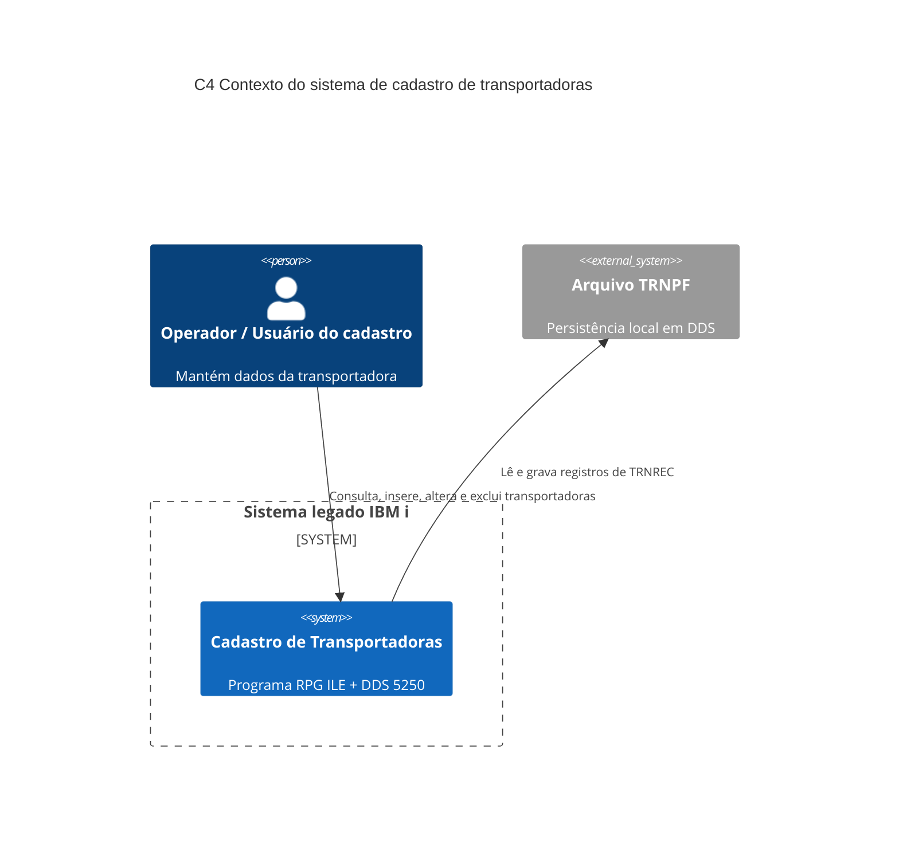

# C4 Context — `transportadora`

```mermaid
C4Context
    title C4 Contexto do sistema de cadastro de transportadoras

    Person(usuario, "Operador / Usuário do cadastro", "Mantém dados da transportadora")
    System_Boundary(legacy, "Sistema legado IBM i") {
        System(app, "Cadastro de Transportadoras", "Programa RPG ILE + DDS 5250")
    }

    System_Ext(db, "Arquivo TRNPF", "Persistência local em DDS")

    Rel(usuario, app, "Consulta, insere, altera e exclui transportadoras")
    Rel(app, db, "Lê e grava registros de TRNREC")
```
