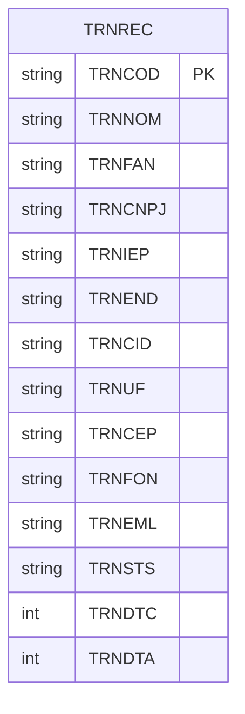

# ERD Completo — `transportadora`

## Observações

- `TRNCOD` é a chave primária.
- `TRNSTS` representa o estado do registro (`A`/`I`).
- Não foram identificados relacionamentos com outras entidades.
