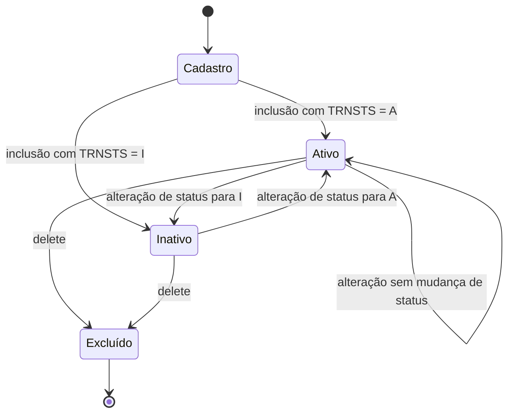

# Máquinas de Estado — `transportadora`

> Gerado pelo Reversa em 2026-09-23
> Escala de confiança: 🟢 CONFIRMADO / 🟡 INFERIDO

## 1. Entidade central

A entidade principal é `TRNREC`, representada pelo arquivo físico `TRNPF`, com campo `TRNSTS` como identificador de estado.

## 2. Estados possíveis

| Estado | Valor | Descrição |
|---|---|---|
| `Ativo` | `A` | Registro habilitado para uso cadastral |
| `Inativo` | `I` | Registro mantido, mas temporariamente inoperante |

## 3. Transições detectadas

## 4. Interpretação

- O campo `TRNSTS` é a única máquina de estado explícita detectada no código.
- O fluxo de tela do programa não implementa um workflow complexo; a lógica está mais próxima de um estado de habilitação operacional do que de um processo de negócio.
- A inclusão e alteração passam por `ValidaDados`, que também restringe `TRNSTS` a `A` ou `I`.

## 5. Observações

- 🟢 CONFIRMADO: valores permitidos e validação no código
- 🟡 INFERIDO: uso comercial/operacional de `A` e `I`, sem confirmação documental externa
