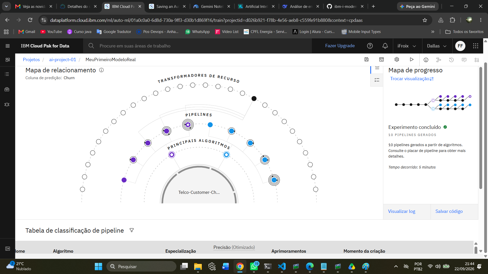
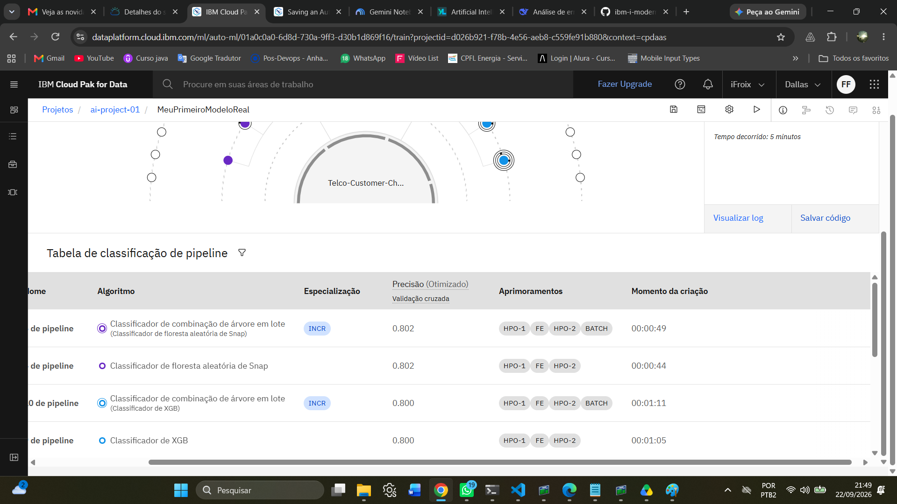

# Projeto: Previsão de Churn (Telco Customer Churn)

## 📌 O Problema de Negócio
Este projeto tem como objetivo prever a evasão de clientes (Churn) em uma empresa de telecomunicações.

## 🛠️ Ferramentas Utilizadas
*   **IBM Cloud Pak for Data:** Plataforma principal.
*   **IBM Watson Studio AutoAI:** Para automatizar a seleção e treinamento de modelos.
*   **Snap ML:** Para treinamento acelerado do modelo de classificação (Random Forest).

## 📊 Resultados e Aprendizados
*   O AutoAI gerou e comparou vários pipelines.
*   O melhor modelo foi o "P5 - Classificador de floresta aleatória de Snap".
*   *[Escreva aqui as métricas que você viu no print, ex: Acurácia de 85%]*

## 📸 Evidências

## 🔮 Próximos Passos (Roadmap)

Este projeto é um laboratório vivo e está em constante evolução. Os próximos passos planejados são:

- [ ] **Implantação do Modelo (Deploy):** Publicar o melhor pipeline (P5 - Snap ML) como um serviço web no IBM Watson Machine Learning.
- [ ] **Criação da API REST:** Gerar um endpoint de API para que o modelo possa receber novos dados e retornar previsões de Churn em tempo real.
- [ ] **Integração com IBM i:** Consumir essa API a partir de um programa RPG ou Java no sistema IBM i (AS/400), demonstrando a modernização na prática.
- [ ] **Documentação da API:** Adicionar exemplos de como chamar a API usando Python e RPG.
